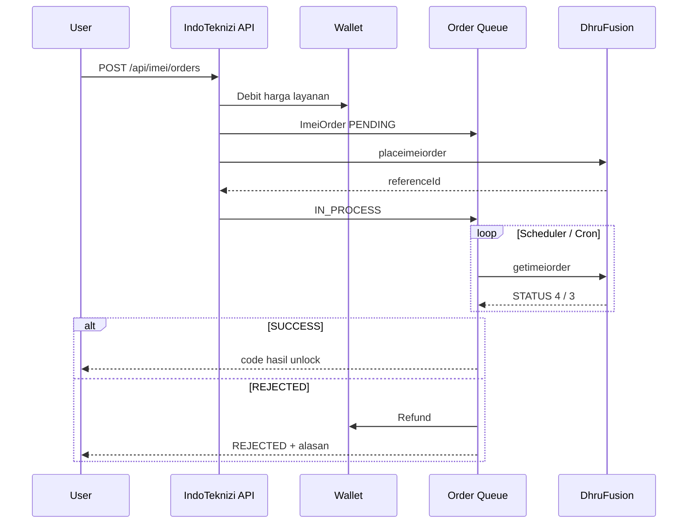

# Dokumentasi API Management — IMEI & Server Services

**Proyek:** IndoTeknizi (`indoteknizi/`)  
**Versi dokumen:** 2026-05-27  
**Supplier default:** DhruFusion (Classic + Pro REST)

Dokumen ini menjelaskan cara **mengelola koneksi API supplier**, **sinkronisasi katalog layanan**, **pemesanan (order)**, dan **pekerjaan latar belakang (cron/scheduler)** — agar pola yang sama dapat diterapkan di proyek lain.

---

## Daftar isi

1. [Ringkasan arsitektur](#1-ringkasan-arsitektur)
2. [Konfigurasi API provider (API Management)](#2-konfigurasi-api-provider-api-management)
3. [Koneksi ke supplier (DhruFusion)](#3-koneksi-ke-supplier-dhrufusion)
4. [Mendapatkan layanan IMEI](#4-mendapatkan-layanan-imei)
5. [Mendapatkan layanan Server](#5-mendapatkan-layanan-server)
6. [Membuat order IMEI](#6-membuat-order-imei)
7. [Membuat order Server](#7-membuat-order-server)
8. [Alur status order & refund](#8-alur-status-order--refund)
9. [Cron job & scheduler](#9-cron-job--scheduler)
10. [Variabel lingkungan](#10-variabel-lingkungan)
11. [Referensi endpoint lengkap](#11-referensi-endpoint-lengkap)
12. [Menerapkan di proyek lain](#12-menerapkan-di-proyek-lain)
13. [Troubleshooting](#13-troubleshooting)

---

## 1. Ringkasan arsitektur

```
┌─────────────────────────────────────────────────────────────────────────┐
│                         ADMIN (API Management)                          │
│  CRUD ImeiApi (host, username, apiKey) → sync/import katalog            │
└───────────────────────────────────┬─────────────────────────────────────┘
                                    │
                                    ▼
┌─────────────────────────────────────────────────────────────────────────┐
│                    Database (PostgreSQL / Prisma)                       │
│  ImeiApi → ImeiService / ServerService → ImeiOrder / ServerOrder        │
└───────────────────────────────────┬─────────────────────────────────────┘
                                    │
          ┌─────────────────────────┼─────────────────────────┐
          ▼                         ▼                         ▼
   User POST order            In-process scheduler      Vercel Cron (backup)
   (wallet debit)            (setiap ~90 detik)        (setiap 2 menit)
          │                         │                         │
          └─────────────────────────┴─────────────────────────┘
                                    │
                                    ▼
                    DhruFusion Classic / Pro (supplier)
```

**Konsep penting:**

| Istilah | Arti |
|--------|------|
| **API Provider** (`ImeiApi`) | Satu akun reseller di supplier (host + username + api key) |
| **toolId** | ID layanan di panel supplier (dipakai saat `placeimeiorder` / `placeserverorder`) |
| **referenceId** | ID order di supplier setelah submit berhasil |
| **Katalog lokal** | `ImeiService` / `ServerService` — harga jual & field wajib dikelola di IndoTeknizi |
| **Wallet user** | Saldo IDR di platform; terpisah dari **kredit reseller** di panel supplier |

**File inti implementasi:**

| Modul | Path |
|-------|------|
| Client DhruFusion | `src/lib/dhru-fusion.ts` |
| Worker order IMEI | `src/lib/imei-order-worker.ts` |
| Worker order Server | `src/lib/server-order-worker.ts` |
| Scheduler IMEI | `src/lib/imei-order-scheduler.ts` |
| Scheduler Server | `src/lib/server-order-scheduler.ts` |
| Enkripsi API key | `src/lib/crypto/imei-api-secret.ts` |
| Validasi request | `src/lib/validations/imei.ts`, `server.ts` |
| Boot scheduler | `src/instrumentation.ts` |
| Cron HTTP | `src/app/api/cron/imei-orders/route.ts` |
| Schema DB | `prisma/schema.prisma` (model `ImeiApi` dst.) |

---

## 2. Konfigurasi API provider (API Management)

### 2.1 Model database `ImeiApi`

| Field | Tipe | Keterangan |
|-------|------|------------|
| `id` | cuid | Primary key |
| `title` | string | Label admin, mis. "Luteam Primary" |
| `host` | string | URL base supplier, mis. `https://luteam.store` (tanpa trailing slash) |
| `username` | string | Username reseller di panel supplier |
| `apiKey` | text | API Access Key (Classic) atau Bearer token (Pro); **disimpan terenkripsi** jika `DATA_ENCRYPTION_KEY` diset |
| `apiType` | string | Default `DhruFusion` (saat ini hanya ini yang diimplementasi penuh) |
| `libraryId` | int | Default `1` (kompatibilitas legacy marvelous) |
| `status` | enum | `ACTIVE` \| `INACTIVE` |
| `notes` | text? | Catatan admin |

Relasi: satu `ImeiApi` punya banyak `ImeiService` dan `ServerService`.

### 2.2 Menambah provider (Admin API)

**Endpoint:** `POST /api/admin/imei/apis`  
**Auth:** Session admin (`requireApiRole(['ADMIN'])`) + CSRF origin check

**Request body:**

```json
{
  "title": "DhruFusion Server 1",
  "host": "https://supplier.example.com",
  "username": "reseller@example.com",
  "apiKey": "your-api-access-key-from-panel",
  "apiType": "DhruFusion",
  "libraryId": 1,
  "status": "ACTIVE",
  "notes": "Akun utama unlock"
}
```

**Validasi (Zod):**

- `title`: min 2 karakter
- `host`: URL valid
- `username`: min 2 karakter
- `apiKey`: min 4 karakter
- `status`: `ACTIVE` | `INACTIVE`

**Response sukses (201):**

```json
{
  "success": true,
  "data": {
    "id": "clx...",
    "title": "DhruFusion Server 1",
    "host": "https://supplier.example.com",
    "username": "reseller@example.com",
    "apiKey": "••••••••",
    "hasApiKey": true,
    "apiType": "DhruFusion",
    "libraryId": 1,
    "status": "ACTIVE",
    "notes": null,
    "createdAt": "...",
    "updatedAt": "..."
  }
}
```

> API key **tidak pernah** dikembalikan plain text ke client setelah disimpan; admin hanya melihat mask `••••••••`.

### 2.3 Operasi CRUD provider

| Method | Path | Keterangan |
|--------|------|------------|
| GET | `/api/admin/imei/apis` | Daftar semua provider + `_count.services` |
| POST | `/api/admin/imei/apis` | Buat provider baru |
| GET | `/api/admin/imei/apis/[id]` | Detail satu provider |
| PATCH | `/api/admin/imei/apis/[id]` | Update (partial; `apiKey` opsional) |
| DELETE | `/api/admin/imei/apis/[id]` | Hapus jika **tidak** ada service terhubung |

### 2.4 Tes koneksi & cek saldo supplier

**Endpoint:** `GET /api/admin/imei/apis/[id]/account`

Memanggil Dhru Classic `accountinfo` dan mengembalikan kredit reseller di panel supplier (bukan saldo wallet user IndoTeknizi).

**Response contoh:**

```json
{
  "success": true,
  "data": {
    "apiId": "clx...",
    "apiTitle": "Luteam Primary",
    "host": "https://luteam.store",
    "username": "reseller@example.com",
    "credit": "12.50",
    "creditNumeric": 12.5,
    "lowBalance": false,
    "hint": "Saldo API tersedia. Jika order masih gagal, cek IMEI valid atau limit layanan."
  }
}
```

**Penting:** `CreditprocessError` saat order biasanya berarti **kredit reseller habis** di supplier, meskipun harga layanan tampil $0.

### 2.5 Enkripsi API key

Set `DATA_ENCRYPTION_KEY` (32 byte, base64):

```bash
openssl rand -base64 32
```

Tanpa key ini, `apiKey` disimpan plaintext (hanya untuk development). Production wajib mengaktifkan enkripsi — lihat `docs/security-hardening/PRODUCTION-READINESS.md`.

Script migrasi: `scripts/encrypt-existing-secrets.ts`, `scripts/rotate-secrets.ts`.

### 2.6 UI Admin

Panel: **`/admin/imei`** → tab API Management (`admin-imei-api-panel.tsx`).

---

## 3. Koneksi ke supplier (DhruFusion)

IndoTeknizi mendukung **dua varian** API DhruFusion; sistem **otomatis** mencoba Pro dulu, lalu Classic.

### 3.1 DhruFusion Classic (legacy)

| Item | Nilai |
|------|-------|
| URL | `POST {host}/api/index.php` |
| Content-Type | `application/x-www-form-urlencoded` |
| Auth | `username` + `apiaccesskey` (field form) |
| Format | `requestformat=JSON`; parameter order dalam XML di field `parameters` |

**Parameter form standar:**

```
username=<reseller>
apiaccesskey=<api_key>
action=<action_name>
requestformat=JSON
parameters=<XML_PARAMETERS>
```

**Action yang dipakai:**

| Action | Fungsi |
|--------|--------|
| `accountinfo` | Cek saldo/kredit reseller |
| `imeiservicelist` | Daftar semua layanan (IMEI + Server dipisah di kode) |
| `placeimeiorder` | Submit order IMEI (atau server via CUSTOMFIELD) |
| `placeserverorder` | Submit order server (jika panel mendukung) |
| `getimeiorder` | Poll status order (IMEI & server) |
| `serverservicelist` | Fallback legacy daftar server |
| `fileservicelist` | Fallback legacy daftar file |

**Mapping status poll (`getimeiorder`):**

| STATUS (angka) | Status IndoTeknizi |
|----------------|-------------------|
| 0 | `IN_PROCESS` (New) |
| 1 | `IN_PROCESS` |
| 3 | `REJECTED` |
| 4 | `SUCCESS` |

### 3.2 DhruFusion Pro (REST)

| Item | Nilai |
|------|-------|
| Base URL | `{host}/api/reseller/v1` |
| Auth | `Authorization: Bearer {apiKey}` |
| Content-Type | `application/json` (POST) |

**Endpoint Pro yang dipakai:**

| Method | Path | Fungsi |
|--------|------|--------|
| GET | `/account` | Info akun |
| GET | `/products` | Semua produk (IMEI + server) |
| POST | `/order` | Place order |
| GET | `/order/{uuid}` | Detail status order |

Produk server dikenali dari `product.type` yang mengandung `server`, `remote`, `file`, atau `tool`.

### 3.3 Credential dari panel supplier

1. Login ke panel reseller (mis. luteam.store).
2. Buka **API Settings** / **Reseller API**.
3. Salin:
   - **API URL** → `host`
   - **Username** → `username`
   - **API Access Key** → `apiKey` (Classic) atau **Bearer Token** (Pro)
4. Simpan di IndoTeknizi via Admin API atau UI.

---

## 4. Mendapatkan layanan IMEI

Alur admin: **Sync (preview)** → **Import (simpan ke DB)** → **Atur harga jual** (opsional via CRUD service).

### 4.1 Sync — ambil daftar dari supplier

**Endpoint:** `POST /api/admin/imei/apis/[id]/sync`  
**Auth:** Admin

**Alur internal:**

1. Coba `DhruFusionProClient.getProducts()` → filter produk non-server (`isImeiProProduct`).
2. Jika Pro kosong/gagal → `DhruFusionClient.getImeiServiceList()` (Classic `imeiservicelist`, filter bukan SERVER/REMOTE/FILE).

**Response contoh:**

```json
{
  "success": true,
  "data": {
    "apiId": "clx...",
    "apiTitle": "Luteam Primary",
    "apiVersion": "classic",
    "totalServices": 42,
    "alreadyImported": 10,
    "services": [
      {
        "toolId": "123",
        "title": "Samsung Unlock Network",
        "groupName": "Samsung",
        "price": 1.5,
        "deliveryTime": "1-24 jam",
        "requiresNetwork": true,
        "requiresModel": false,
        "requiresProvider": false,
        "requiresPin": false,
        "requiresKbh": false,
        "requiresMep": false,
        "requiresPrd": false,
        "requiresSn": false,
        "alreadyImported": false
      }
    ]
  }
}
```

Field `requires*` diisi dari flag Dhru `Requires.Network`, `Requires.Mobile`, dll. (= `Required`).

### 4.2 Import — simpan ke katalog lokal

**Endpoint:** `POST /api/admin/imei/apis/[id]/import`

**Request:**

```json
{
  "services": [
    {
      "toolId": "123",
      "title": "Samsung Unlock Network",
      "groupName": "Samsung",
      "price": 1.5,
      "deliveryTime": "1-24 jam",
      "requiresNetwork": true,
      "requiresModel": false,
      "requiresProvider": false,
      "requiresPin": false,
      "requiresKbh": false,
      "requiresMep": false,
      "requiresPrd": false,
      "requiresSn": false
    }
  ]
}
```

- Grup (`ImeiServiceGroup`) dibuat otomatis jika belum ada.
- Service dengan `toolId` + `apiId` yang sudah ada **diskip**.
- Harga awal = harga supplier (`price`); **atur ulang harga jual IDR** lewat admin service CRUD.

**Response:**

```json
{
  "success": true,
  "data": {
    "imported": 5,
    "skipped": 2,
    "message": "5 service berhasil diimport"
  }
}
```

### 4.3 Katalog publik (user / integrasi eksternal)

**Endpoint:** `GET /api/imei/services`  
**Auth:** Tidak perlu (public)

**Query:**

| Param | Keterangan |
|-------|------------|
| `q` | Cari judul/deskripsi/grup |
| `groupId` | Filter per grup |

**Response:**

```json
{
  "success": true,
  "data": {
    "services": [
      {
        "id": "clx...",
        "title": "Samsung Unlock",
        "description": null,
        "price": "50000",
        "deliveryTime": "1-24 jam",
        "requiresImei": true,
        "requiresNetwork": true,
        "requiresModel": false,
        "group": { "id": "...", "title": "Samsung" }
      }
    ],
    "groups": [
      { "id": "...", "title": "Samsung", "_count": { "services": 3 } }
    ]
  }
}
```

**Endpoint terkait:**

| Method | Path | Auth |
|--------|------|------|
| GET | `/api/imei/services/[id]` | Public — detail satu layanan |
| GET | `/api/imei/groups` | Public — daftar grup |
| GET/POST/PATCH/DELETE | `/api/admin/imei/services` | Admin — CRUD manual |
| GET/POST/PATCH/DELETE | `/api/admin/imei/groups` | Admin — CRUD grup |

---

## 5. Mendapatkan layanan Server

Server = layanan berbasis akun/file (username, password, email, qty, dll.) — bukan IMEI 15 digit.

### 5.1 Sync server dari supplier

**Endpoint:** `POST /api/admin/imei/apis/[id]/sync-server`

**Alur:**

1. Classic: `getServerServiceList()` — filter `SERVICETYPE`/`GROUPTYPE` SERVER, REMOTE, FILE dari `imeiservicelist`; fallback `serverservicelist` / `fileservicelist`.
2. Pro: `getProducts()` → filter `isServerProProduct`.

**Response:** struktur mirip sync IMEI, dengan `requiredFields` (JSON array nama field) per service.

### 5.2 Import server

**Endpoint:** `POST /api/admin/imei/apis/[id]/import-server`

Body mirip import IMEI; membuat `ServerServiceBox` (grup) dan `ServerService` dengan `requiredFields` dari supplier.

### 5.3 Katalog publik server

**Endpoint:** `GET /api/imei/server-services`  
**Auth:** Public

Mengembalikan layanan `ACTIVE` beserta `requiredFields` (schema field untuk form order).

**Preset field admin** (`src/lib/server-fields.ts`):

| key | Label |
|-----|-------|
| `qnt` | Quantity |
| `sn` | Serial Number |
| `email` | Email |
| `username` | Username |
| `password` | Password |
| `id` | ID |
| `licensekey` | License Key |
| `comments` | Catatan |

Admin dapat menyempurnakan schema lewat `PATCH /api/admin/imei/server-services/[id]` dengan `fieldDefs` atau `requiredFields` JSON.

---

## 6. Membuat order IMEI

### 6.1 Prasyarat user

1. User **login** (session NextAuth cookie).
2. **Wallet** cukup untuk `ImeiService.price` (IDR).
3. Service `ACTIVE`.
4. Tidak ada order **PENDING/IN_PROCESS** dengan IMEI sama pada **API provider yang sama**.

### 6.2 Place order

**Endpoint:** `POST /api/imei/orders`  
**Auth:** User terautentikasi (`requireApiAuth`)

**Request:**

```json
{
  "serviceId": "clx_service_id",
  "imei": "353456789012345",
  "network": "Telkomsel",
  "model": "SM-S928B",
  "provider": null,
  "pin": null,
  "kbh": null,
  "mep": null,
  "prd": null,
  "serialNumber": null,
  "note": "Urgent"
}
```

**Validasi:**

- `imei`: regex `^\d{15,17}$`
- Field opsional wajib diisi jika flag service `requiresNetwork`, `requiresModel`, dll. = true

**Alur server-side:**

```
POST /api/imei/orders
  → Validasi service & field
  → Cek duplikat IMEI aktif (per apiId)
  → Transaction: debit wallet + buat ImeiOrder (PENDING)
  → submitImeiOrderToSupplier() — Dhru placeimeiorder
  → pollImeiOrderFromSupplier() (jika ada referenceId)
  → scheduleImeiOrderFollowUp() — poll di 20s, 60s, 120s, 300s
```

**Response sukses (201):**

```json
{
  "success": true,
  "data": {
    "id": "clx...",
    "orderCode": "IMEI-2026-ABC123",
    "status": "PENDING",
    "referenceId": "987654",
    "imei": "353456789012345",
    "price": "50000",
    "service": { "id": "...", "title": "Samsung Unlock" }
  }
}
```

**Kode error umum:**

| HTTP | Pesan | Penyebab |
|------|-------|----------|
| 401 | Unauthorized | Belum login |
| 402 | Saldo tidak cukup | Wallet < harga |
| 404 | Layanan tidak ditemukan | Service nonaktif/hapus |
| 409 | IMEI masih diproses | Duplikat aktif per supplier |

### 6.3 Field yang dikirim ke Dhru (Classic)

Worker membangun map dari order (`buildDhruOrderFields`):

```
IMEI, NETWORK, MODEL, PROVIDER, PIN, KBH, MEP, PRD, SN
```

Submit: `placeimeiorder` dengan `ID=<toolId>` + `CUSTOMFIELD` (base64 JSON); fallback parameter flat.

### 6.4 Lihat & batalkan order

| Method | Path | Keterangan |
|--------|------|------------|
| GET | `/api/imei/orders` | Daftar order user (`?status=`, `?q=`) |
| GET | `/api/imei/orders/[id]` | Detail (hanya milik user) |
| DELETE | `/api/imei/orders/[id]` | Batalkan jika masih `PENDING` + refund wallet |

---

## 7. Membuat order Server

### 7.1 Place order

**Endpoint:** `POST /api/imei/server-orders`  
**Auth:** User

**Request:**

```json
{
  "serviceId": "clx_server_service_id",
  "requiredFields": {
    "username": "user@example.com",
    "password": "secret123",
    "qnt": "1"
  }
}
```

**Alur:** sama dengan IMEI — validasi field dinamis → debit wallet → `ServerOrder` PENDING → `submitServerOrderToSupplier()` → follow-up poll.

**Order code:** prefix `SRV-2026-XXXXXX`.

Worker mencoba berurutan: `placeserverorder` (flat & CUSTOMFIELD) → `placeimeiorder` (untuk panel yang hanya punya satu action).

### 7.2 Endpoint terkait

| Method | Path | Auth |
|--------|------|------|
| GET | `/api/imei/server-orders` | User |
| GET | `/api/imei/server-orders/[id]` | User |
| GET/PATCH | `/api/admin/imei/server-orders/[id]` | Admin oversight + refund manual |

---

## 8. Alur status order & refund

### 8.1 Status order

```
PENDING → IN_PROCESS → SUCCESS
                    ↘ REJECTED
                    ↘ CANCELLED (user cancel / admin)
```

| Status | Arti |
|--------|------|
| `PENDING` | Dibuat, belum/tidak berhasil submit ke supplier |
| `IN_PROCESS` | Sudah ada `referenceId`, menunggu hasil supplier |
| `SUCCESS` | Supplier selesai; `code` berisi hasil unlock |
| `REJECTED` | Ditolak supplier → **refund otomatis** ke wallet |
| `CANCELLED` | Dibatalkan user (PENDING) |

### 8.2 Refund otomatis

Saat status menjadi `REJECTED` (submit gagal atau poll status 3):

- Wallet dikredit kembali (`REFUND` ledger).
- `comments` berisi pesan terformat (`formatSupplierRejectReason`).

### 8.3 Duplikasi & keamanan

- **IMEI aktif:** tidak boleh 2 order PENDING/IN_PROCESS untuk IMEI sama pada provider yang sama.
- **Reference collision:** jika `referenceId` supplier bentrok dengan order lain, order ditolak dengan pesan duplikat.
- **Race wallet:** balance dibaca ulang di dalam transaction sebelum debit.

---

## 9. Cron job & scheduler

IndoTeknizi memakai **dua lapisan** pemrosesan antrian order:

### 9.1 In-process scheduler (utama)

Diaktifkan saat `npm run dev` / `npm start` via `src/instrumentation.ts`.

| Scheduler | Env interval | Default | Env disable |
|-----------|--------------|---------|-------------|
| IMEI orders | `IMEI_ORDER_POLL_INTERVAL_MS` | 90 detik (min 30s) | `IMEI_ORDER_SCHEDULER_ENABLED=false` |
| Server orders | `SERVER_ORDER_POLL_INTERVAL_MS` | sama dengan IMEI | `SERVER_ORDER_SCHEDULER_ENABLED=false` |
| Order tracking (marketplace) | `ORDER_TRACKING_POLL_INTERVAL_MS` | 15 menit | `ORDER_TRACKING_SCHEDULER_ENABLED` |
| Wallet reconciliation | `WALLET_RECONCILIATION_INTERVAL_MS` | 24 jam | `WALLET_RECONCILIATION_SCHEDULER_ENABLED` |

**Per tick IMEI/Server (`processImeiOrderQueue` / `processServerOrderQueue`):**

| Operasi | Limit default |
|---------|---------------|
| Submit order `PENDING` tanpa `referenceId` | 20 per tick |
| Poll order in-flight / tanpa `code` | 50 per tick |

**Follow-up setelah user POST order:**

Poll tambahan pada detik: **20, 60, 120, 300** (`scheduleImeiOrderFollowUp` / `scheduleServerOrderFollowUp`).

### 9.2 Vercel Cron (backup serverless)

File: `vercel.json`

```json
{
  "crons": [
    {
      "path": "/api/cron/imei-orders",
      "schedule": "*/2 * * * *"
    }
  ]
}
```

**Jadwal:** setiap **2 menit**.

**Endpoint:** `GET` atau `POST /api/cron/imei-orders`

**Auth wajib:**

```http
Authorization: Bearer <CRON_SECRET>
```

**Response contoh:**

```json
{
  "success": true,
  "data": {
    "message": "IMEI & server order queues processed",
    "imei": {
      "submitted": 2,
      "polled": 5,
      "submitResults": [...],
      "pollResults": [...]
    },
    "server": {
      "submitted": 0,
      "polled": 1,
      "submitResults": [],
      "pollResults": [...]
    }
  }
}
```

**Kapan pakai cron HTTP vs in-process:**

| Deploy | Rekomendasi |
|--------|-------------|
| VPS / Docker long-running | In-process scheduler cukup; cron HTTP opsional sebagai backup |
| Vercel serverless | **Wajib** set `CRON_SECRET` + Vercel Cron; in-process **tidak** jalan antar cold start |
| Keduanya aktif | Aman (idempotent poll); hindari interval terlalu agresif ke supplier |

### 9.3 Rotasi CRON_SECRET

Selama rotasi, set `CRON_SECRET` (baru) dan `CRON_SECRET_OLD` (lama). Keduanya diterima oleh `validateCronSecret`.

### 9.4 Cron lain (bukan IMEI supplier)

| Path | Fungsi |
|------|--------|
| `/api/cron/order-tracking` | Sync resi marketplace (BinderByte) |
| `/api/cron/wallet-reconciliation` | Cek konsistensi ledger wallet |

### 9.5 Cron eksternal manual (curl)

```bash
# Generate secret
openssl rand -base64 32

# Panggil antrian IMEI + Server
curl -s -H "Authorization: Bearer YOUR_CRON_SECRET" \
  "https://your-domain.com/api/cron/imei-orders"
```

Untuk crontab Linux (setiap 2 menit):

```cron
*/2 * * * * curl -fsS -H "Authorization: Bearer YOUR_CRON_SECRET" https://your-domain.com/api/cron/imei-orders >/dev/null
```

---

## 10. Variabel lingkungan

| Variable | Wajib prod | Keterangan |
|----------|------------|------------|
| `DATABASE_URL` | Ya | PostgreSQL |
| `AUTH_SECRET` | Ya | Session NextAuth |
| `AUTH_URL` / `NEXT_PUBLIC_APP_URL` | Ya | Base URL aplikasi |
| `DATA_ENCRYPTION_KEY` | Ya | Enkripsi `ImeiApi.apiKey` |
| `CRON_SECRET` | Ya (serverless) | Bearer untuk `/api/cron/*` |
| `CRON_SECRET_OLD` | Opsional | Rotasi secret |
| `IMEI_ORDER_POLL_INTERVAL_MS` | Opsional | Default 90000 |
| `IMEI_ORDER_SCHEDULER_ENABLED` | Opsional | `false` untuk matikan |
| `SERVER_ORDER_POLL_INTERVAL_MS` | Opsional | Fallback ke IMEI interval |
| `SERVER_ORDER_SCHEDULER_ENABLED` | Opsional | `false` untuk matikan |
| `STRESS_TEST_MODE` | **Jangan** di prod | Mock Dhru tanpa network |

Lihat `.env.example` untuk daftar lengkap aplikasi.

---

## 11. Referensi endpoint lengkap

### Format respons standar

```json
{ "success": true, "data": { ... } }
{ "success": false, "error": "Pesan error" }
```

### Admin — API Management

| Method | Path |
|--------|------|
| GET/POST | `/api/admin/imei/apis` |
| GET/PATCH/DELETE | `/api/admin/imei/apis/[id]` |
| GET | `/api/admin/imei/apis/[id]/account` |
| POST | `/api/admin/imei/apis/[id]/sync` |
| POST | `/api/admin/imei/apis/[id]/sync-server` |
| POST | `/api/admin/imei/apis/[id]/import` |
| POST | `/api/admin/imei/apis/[id]/import-server` |

### Admin — Katalog & order

| Method | Path |
|--------|------|
| GET/POST | `/api/admin/imei/groups`, `groups/[id]` |
| GET/POST/PATCH/DELETE | `/api/admin/imei/services`, `services/[id]` |
| GET/POST/PATCH/DELETE | `/api/admin/imei/server-boxes`, `[id]` |
| GET/POST/PATCH/DELETE | `/api/admin/imei/server-services`, `[id]` |
| GET | `/api/admin/imei/orders` |
| GET/PATCH | `/api/admin/imei/orders/[id]` |
| GET | `/api/admin/imei/server-orders` |
| GET/PATCH | `/api/admin/imei/server-orders/[id]` |

### Public / User

| Method | Path | Auth |
|--------|------|------|
| GET | `/api/imei/services`, `services/[id]`, `groups` | Public |
| GET | `/api/imei/server-services` | Public |
| GET/POST | `/api/imei/orders` | User |
| GET/DELETE | `/api/imei/orders/[id]` | User |
| GET/POST | `/api/imei/server-orders` | User |
| GET | `/api/imei/server-orders/[id]` | User |

### Cron

| Method | Path | Auth |
|--------|------|------|
| GET/POST | `/api/cron/imei-orders` | Bearer `CRON_SECRET` |

> **Catatan:** PRD (`docs/PRD-IMEI-SERVER-SERVICES.md` §8) memuat path aspirasional (`/api/admin/providers`). **Implementasi aktual** memakai prefix `/api/admin/imei/` dan `/api/imei/` seperti di atas.

---

## 12. Menerapkan di proyek lain

Checklist integrasi API Management ke proyek baru:

### Fase 1 — Infrastruktur

- [ ] PostgreSQL + model `ImeiApi`, `ImeiService`, `ImeiOrder`, `ServerService`, `ServerOrder`
- [ ] Enkripsi secret at rest (`DATA_ENCRYPTION_KEY`)
- [ ] Port/copy `dhru-fusion.ts` atau wrapper HTTP ke supplier Anda

### Fase 2 — Admin flow

1. **POST** provider dengan host, username, apiKey.
2. **GET** `/account` — verifikasi koneksi & saldo supplier.
3. **POST** `/sync` + `/import` — isi katalog IMEI.
4. **POST** `/sync-server` + `/import-server` — isi katalog server.
5. Set harga jual (markup) per service di admin CRUD.

### Fase 3 — User flow

1. **GET** `/api/imei/services` — tampilkan katalog.
2. User top-up wallet (jika model prepaid).
3. **POST** `/api/imei/orders` — place order.
4. Poll status via GET order atau WebSocket (belum ada di IndoTeknizi; andalkan scheduler).

### Fase 4 — Background processing

- Long-running: aktifkan scheduler di `instrumentation.ts`.
- Serverless: Vercel Cron + `CRON_SECRET` setiap 1–2 menit.
- Jangan andalkan hanya submit sinkron — selalu ada antrian poll.

### Fase 5 — Production

- [ ] `STRESS_TEST_MODE` tidak aktif
- [ ] `CRON_SECRET` kuat & tidak di-commit
- [ ] Rate limit ke supplier (interval ≥ 30s)
- [ ] Monitoring log `[IMEI_SCHEDULER]`, `[CRON_IMEI_ORDERS]`
- [ ] Alert saldo supplier rendah (manual via `/account` atau tambahkan worker balance — belum diimplementasi)

### Contoh urutan API dari proyek eksternal (machine-to-machine)

Jika proyek lain **bukan** browser tapi backend service:

1. Saat ini endpoint user memerlukan **session cookie NextAuth** — untuk integrasi M2M perlu tambahan API key / service token (belum ada; bisa ditambahkan sebagai middleware terpisah).
2. Alternatif sementara: gunakan admin sync/import dari IndoTeknizi, lalu proyek lain consume **katalog public** `GET /api/imei/services` + arahkan user ke IndoTeknizi untuk checkout, **atau** implementasikan route khusus dengan API key internal.

---

## 13. Troubleshooting

| Gejala | Kemungkinan penyebab | Tindakan |
|--------|---------------------|----------|
| Sync server kosong, sync IMEI OK | Akun supplier hanya punya layanan IMEI | Normal; gunakan sync IMEI saja |
| `CreditprocessError` | Kredit reseller habis di supplier | Top-up panel supplier; cek `/account` |
| Order PENDING lama | Scheduler mati / serverless tanpa cron | Aktifkan scheduler atau Vercel Cron |
| `REST API Pro tidak tersedia` | Host hanya Classic | Otomatis fallback Classic |
| IMEI ditolak validasi | Bukan 15–17 digit | Cek `*#06#` |
| 409 duplikat IMEI | Order aktif sama supplier | Tunggu selesai atau cancel |
| API key tidak bisa diupdate | PATCH tanpa field `apiKey` | Kirim `apiKey` baru di body PATCH |
| Cron 401 | `CRON_SECRET` salah | Periksa header Bearer |
| Cron 503 | `CRON_SECRET` tidak diset | Set di environment deploy |

**Log tags untuk debugging:**

- `[ADMIN_IMEI_API_SYNC]`, `[ADMIN_IMEI_API_IMPORT]`
- `[IMEI_ORDERS_POST]`, `[IMEI_ORDERS_SUBMIT_SUPPLIER]`
- `[IMEI_SCHEDULER]`, `[CRON_IMEI_ORDERS]`

**Dokumen terkait:**

- `docs/PRD-IMEI-SERVER-SERVICES.md` — PRD lengkap & spesifikasi Dhru mentah
- `docs/functional-tests/07-imei.md`, `08-server.md` — skenario uji
- `docs/security-hardening/PRODUCTION-READINESS.md` — checklist production

---

## Diagram alur order (ringkas)



---

*Dokumen ini mencerminkan implementasi di branch utama per 2026-05-27. Jika ada perbedaan dengan PRD, utamakan path dan perilaku kode di `src/app/api/` dan `src/lib/`.*
